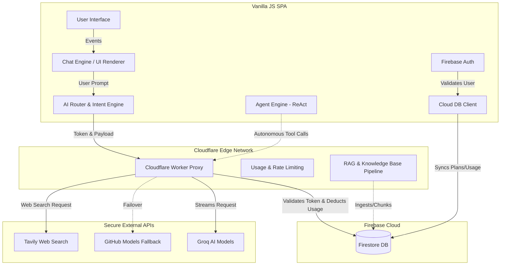
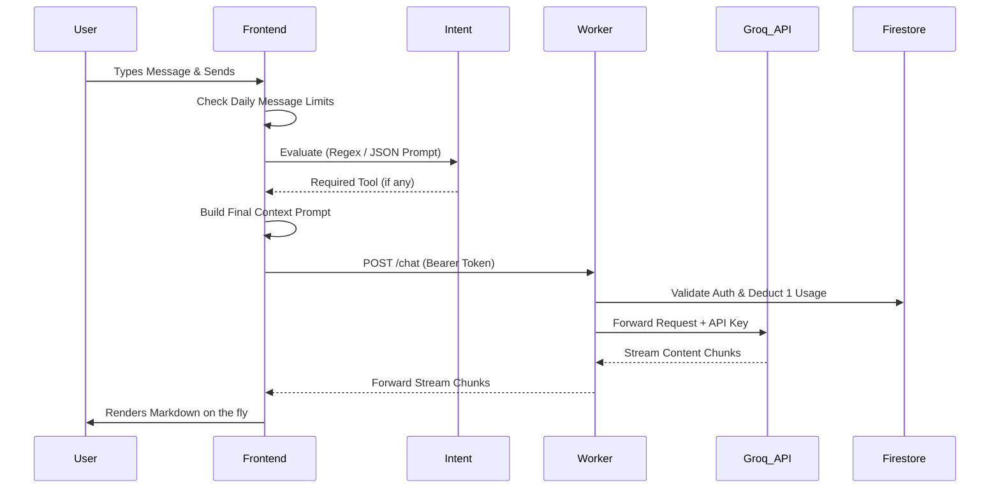

# 🌌 ToolsHub: The Ultimate Developer & AI Agent Codex

> **MISSION DIRECTIVE:** This document is the ultimate source of truth for ToolsHub. It is specifically engineered to be ingested by AI agents and Senior Engineers. By reading this file, an AI must perfectly understand the entire architectural state, security boundaries, component responsibilities, data flows, and future roadmap without needing to scan individual source files. **Read carefully before executing any code changes.**


---

## 🛑 1. Core Architectural Laws (Zero Compromise)

ToolsHub operates on a strictly decoupled **Frontend (Vanilla HTML/CSS/JS SPA) + Edge Backend (Cloudflare Workers) + Database (Firebase Firestore)** model. If you break these laws, you break the system.

1. **NO FRONTEND API KEYS:** The frontend (`/js/*`, `index.html`) is public. Never hardcode, fetch, or store provider API keys (Groq, Tavily, etc.) in the frontend source code. 
2. **EDGE PROXY MANDATE:** All LLM and 3rd-party tool requests **must** route through the Cloudflare Worker (`/worker/src/index.js`). The worker holds the secrets (`env.GROQ_API_KEY`, `env.TAVILY_API_KEY`) and securely forwards the requests.
3. **CORS FAIL-CLOSED:** The worker must enforce strict CORS.
4. **STREAMING BY DEFAULT:** ToolsHub is built for real-time UX. All LLM responses stream natively from Groq → Cloudflare Worker (passthrough) → Frontend (`chatEngine.js`), parsing markdown on the fly.
5. **VANILLA JS MODULARITY:** No React, No Vue. The frontend uses ES6 Modules (IIFE Pattern) for state encapsulation. Do not introduce massive frontend frameworks.

---

## 🏗️ 2. High-Level System Architecture



---

## 🧠 3. Deep Dive: Component Topology & File Manifest

### Frontend Application (`/js/`)
The frontend uses the Immediately Invoked Function Expression (IIFE) pattern to create pseudo-classes and singletons.

#### A. Core & Bootstrap (`js/core/`)
- **`app.js`**: The main entry point. Binds UI event listeners (Sidebar, Settings, Auth Overlays). It initializes the application state, manages "Agent Mode" toggles, and syncs real-time usage data.

#### B. AI & Routing (`js/ai/`)
- **`intent.js`**: The Brain. Takes user input and decides if a tool is needed. 
  - **Phase 1 (Regex):** Ultra-fast regex matching.
  - **Phase 2 (LLM Fallback):** If Regex fails, it builds a specific JSON-mode prompt and sends it to Groq to classify the intent (with built-in Hinglish detection logic).
- **`router.js`**: Orchestrates the flow. Once `intent.js` decides the action, `router.js` invokes the specific tool or routes to the standard chat completion pipeline.
- **`prompt.js`**: Manages the System Prompt. Injects dynamic context (current time, date, user preferences) before sending to the LLM.
- **`agentEngine.js`**: Advanced execution environment for multi-step reasoning. Built to support ReAct (Reason-Act) autonomous workflows.

#### C. Tool Implementations (`js/services/tools/` & `js/tools/`)
- **`registry.js` & `connectorsRegistry.js`**: The central dictionaries of available built-in tools and external integrations (Connectors). Connectors ship as honest empty-states pending backend implementations.
- **`searchService.js`**: Executes Web Searches by proxying through the Cloudflare Worker to Tavily.

#### D. State & Storage (`js/services/`)
- **`cloudDb.js`**: Handles Firebase Firestore integration. Saves chat histories, tracks exact token usage & message caps securely (e.g., fetching `users/{uid}/usage/{today}` written by the Worker).
- **`localSettings.js`**: Manages local browser state (Theme, Persona overrides).
- **`firebase.js` / `auth.js`**: Modular Firebase v10 initialization and authentication.

#### E. View Layer (`js/ui/`)
- **`chatEngine.js`**: Manages the message DOM, auto-scrolling, Markdown parsing (via `marked.js`), handles the fake typewriter effect, and manages Persona Context injection.
- **`sidebar.js`**: Renders chat history, grouped contextually (Today, Last 7 Days).
- **`bottomsheet.js`**: Handles UI overlays for tools and LLM selection menus (badges `.mode-pill-tier` for unlocked models vs locked).
- **`advancedControls.js`**: Hub for Agent Mode toggles, Model LLM Engines, Persona Pickers, and Connectors.
- **`changePlanModal.js`**: Dynamic pricing modal handling tiered subscription plans (`plans.js`), striking through original prices for flagship plans, and triggering Razorpay payments.
- **`personaPicker.js`**: Allows users to override the default system instruction behavior based on predefined "personas" (e.g., Coding Expert, Writing Assistant).

### Edge Backend (`/worker/`)
- **`src/index.js`**: Cloudflare Worker script.
  - **Rate Limiting & Auth Validation:** Verifies Firebase JWT tokens. Limits usage (e.g., 15/day for Free users) by updating secure Firestore `usage/{today}` documents.
  - **Groq/Tool Proxying:** Validates models, injects keys, streams responses.

---

## 🔄 4. Exact Data Flow: "A Message's Journey"



---

## 🔮 5. Current State & Future Roadmap (For AI Agents)

If you are an AI tasked with upgrading this system, you must know what has already been built vs what is upcoming.

### A. Advanced Agentic Workflows (Agent Mode)
- **Current State:** The `agentEngine.js` has been implemented with an execution bridge and autonomous tool execution. A hidden developer bypass (Shift+Click on Agent Mode) exists for debugging.
- **Future Plan:** Expand ReAct (Reason-Act) workflow stability, add more complex multi-step reasoning capabilities, and allow agents to parallelize tool calls.

### B. Connectors Architecture (External Data)
- **Current State:** Connectors registry (`connectorsRegistry.js`) and UI overlays are built and shipped as honest empty-states pending backend implementations.
- **Future Plan:** Implement OAuth flows in the Cloudflare Worker to fetch data from Notion, Slack, and Google Drive.

### C. RAG (Retrieval-Augmented Generation) & Knowledge Base
- **Current State:** A complete RAG pipeline is implemented. Features include a knowledge base ingestion pipeline with text chunking, duplicate detection, and ingest cache initialization. The worker supports RAG service logic and handles Hinglish intent detection properly to avoid trigger failures.
- **Future Plan:** Expand the vector storage scale and add visual/multimodal document parsing.

### D. Billing & Subscription Management
- **Current State:** Fully integrated with **Razorpay**. `changePlanModal.js` handles tiered subscriptions, striking through original prices for flagship plans, and triggering Razorpay payments. The worker tracks daily usage limits in Firestore (`users/{uid}/usage/{today}`) to enforce plan caps strictly on the backend.

### E. File Uploads & Vision
- **Future Plan:** LLaVA/Vision models via Groq. Update `chatEngine.js` to accept Image inputs (Base64), routing to a Vision-capable model (`llama-3.2-11b-vision-preview`).

---

## 🛡 6. Security Hardening & Fallback Providers

ToolsHub implements automatic zero-frontend-change fallback mechanisms to ensure high availability when primary AI providers fail.

### GitHub Models Fallback
If the primary Groq API fails (network error, timeout, or non-2xx status), the Cloudflare Worker can automatically failover to GitHub Models.
- **Supported Models**: Currently maps `llama-3.3-70b-versatile` to `Llama-3.3-70B-Instruct`. Other models degrade gracefully.
- **Required Secret**: A Cloudflare secret `GITHUB_MODELS_TOKEN` is required.
- **Command to set**: 
  ```bash
  npx wrangler secret put GITHUB_MODELS_TOKEN
  ```

---

## 🛠 7. Deployment Playbook

If a deployment is requested, execute exactly this sequence:

**1. Syntax & Sanity Check:**
```bash
node -c worker/src/index.js
node -c js/core/app.js
node -c js/ai/intent.js
```

**2. Backend Deployment:**
```bash
cd worker
npx wrangler deploy
```

**3. Frontend Deployment:**
```bash
git add .
git commit -m "deploy: update frontend"
git push origin main
firebase deploy --only hosting
```

---
*End of Codex. You are now initialized with absolute knowledge of ToolsHub.*
